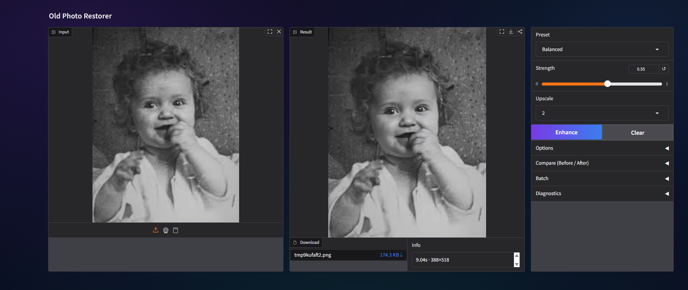

# 🖼️ Old Photo Restorer

A focused **Gradio** app for **best-effort face restoration** in old / low-quality photos — presets, a simple strength control, optional upscaling, and batch ZIP export.


[](https://huggingface.co/spaces/tarekmasryo/Old-Photo-Restorer)

---

## Preview




---

## What it does

- Restores **faces** using **GFPGAN** (background may improve less).
- Presets for predictable results: `Fidelity` · `Balanced` · `Aggressive`
- **Single image** + **Batch** processing (ZIP download)

---

## Quickstart (Local)

```bash
git clone https://github.com/tarekmasryo/Old-Photo-Restorer.git
cd Old-Photo-Restorer

python -m venv .venv
# Windows:
.venv\Scripts\activate
# macOS/Linux:
source .venv/bin/activate

pip install -U pip
pip install -r requirements.txt

python app.py
```

Open the local Gradio URL printed in the terminal.

---

## Controls

- **Strength**: restoration intensity  
  Higher = stronger restoration, higher chance of artifacts.
- **Upscale**: output scale factor  
  Higher = larger output, higher latency/memory.

---

## Model weights (do not commit)

Weights are downloaded on first run and cached locally (typically under `weights/`).

Add to `.gitignore`:

```gitignore
weights/
```

---

## Project structure

```text
.
├── app.py
├── requirements.txt
├── assets/
│   └── Example.png
├── .gitignore
├── LICENSE
└── README.md
```

---

## Notes

- Results depend on input quality (blur/compression/scratches/face size).
- Not intended for forensic or identity-critical use.

---

## License

Apache-2.0
